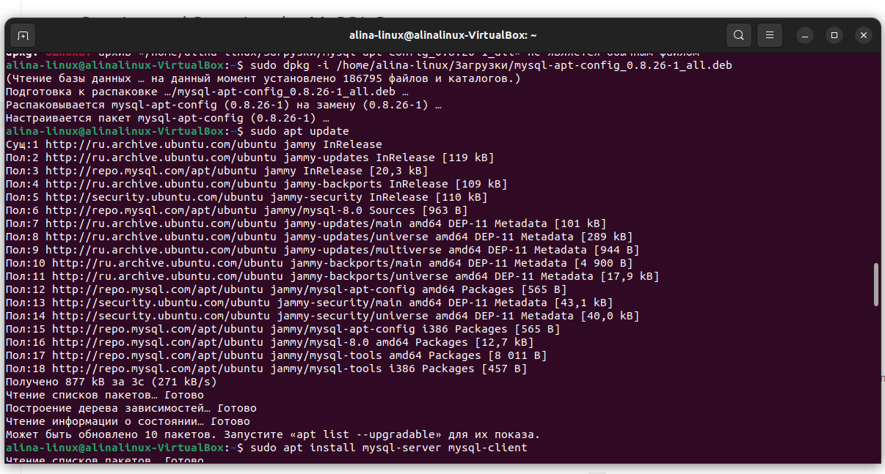
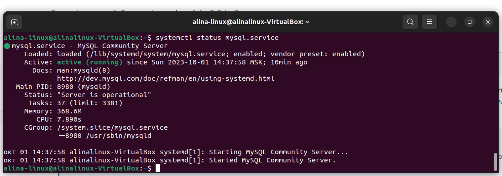
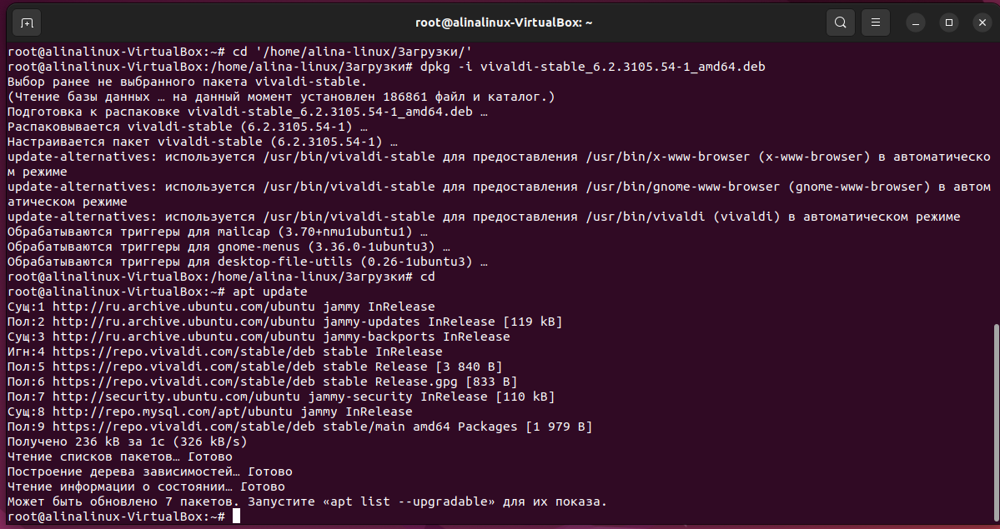
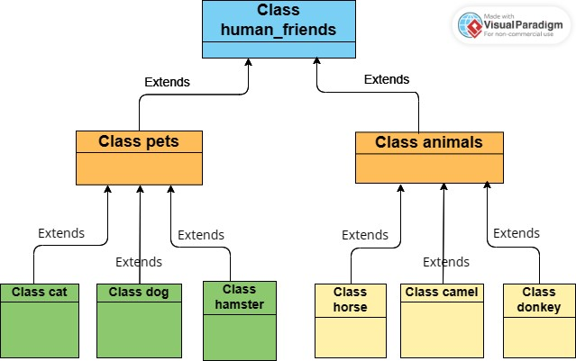

# Итоговая контрольная работа

## Задание

1. Используя команду cat в терминале операционной системы Linux, 
создать два файла Домашние животные (заполни файл собаками, кошками, хомяками) и Вьючные животные (заполни файл лошадьми,
верблюдамии ослы), а затем объединить их. Просмотреть содержимое созданного файла. 
Переименовать файл, дав ему новое имя (друзья человека)

2. Создать директорию, переместить файл туда

3. Подключить дополнительный репозиторий MySQL.
Установить любой пакет из этого репозитория

sudo dpkg -i /home/alina-linux/Загрузки/mysql-apt-config_0.8.26-1_all \
sudo apt udate \
sudo apt install mysql-server mysql-client \
systemctl status mysql.service \

4. Установить и удалить deb-пакет с помощью dpkg

sudo bash \
cd '/home/alina-linux/Загрузки/'
dpkg -i vivaldi-stable_6.2.3105.54-1_amd64.deb \

dpkg -r vivaldi-stable_6.2.3105.54-1_amd64 \
dpkg -p vivaldi-stable_6.2.3105.54-1_amd64 

5. См. файлы png part1-part5

6. Нарисовать диаграмму, в которой есть класс родительский, класс домашние животные и вьючные животные, в составы которых в случае домашних животных войдут классы: собаки, кошки, хомяки,а в класс вьючные животные войдут: лошади, верблюды и ослы

7. В подключенном MySQL репозитории создать базу данных “Друзья человека”

 CREATE DATABASE IF NOT EXISTS human_friends; \
 USE human_friends; 

 8. Создать таблицы с иерархией из диаграммы в БД

 9. Заполнить низкоуровневые таблицы именами (животных), командами которые они выполняют и датами рождения 

CREATE TABLE class_human_friends \
( \
id INT AUTO_INCREMENT PRIMARY KEY, \
name VARCHAR(20) \
);

CREATE TABLE class_pets \
( \
id INT AUTO_INCREMENT PRIMARY KEY, \
pet_name VARCHAR(20), \
class_id INT, \
FOREIGN KEY (class_id) REFERENCES class_human_friends (id) ON DELETE CASCADE ON UPDATE CASCADE \
);

CREATE TABLE class_animals \
( \
id INT AUTO_INCREMENT PRIMARY KEY, \
animals_name VARCHAR(20), \
class_id INT, \
FOREIGN KEY (class_id) REFERENCES class_human_friends (id) ON DELETE CASCADE ON UPDATE CASCADE \
);

INSERT INTO class_human_friends (name) \
VALUES ('PETS'), ('ANIMALS');

INSERT INTO class_pets (pet_name, class_id) \
VALUES ('cat', 1), ('dog', 1), ('hamster', 1);

INSERT INTO class_animals (animals_name, class_id) \
VALUES ('horse', 2), ('camel', 2), ('donkey', 2);

CREATE TABLE cats \
( \
id INT AUTO_INCREMENT PRIMARY KEY, \
birthday DATE, \
command VARCHAR(30), \
group_id INT, \
FOREIGN KEY (group_id) REFERENCES class_pets (id) ON DELETE CASCADE ON UPDATE CASCADE \
);

INSERT INTO cats (name, birthday, command, group_id) \
VALUES ('Timosha', '2022-02-22', 'play', 1), \
('Tosya', '2019-01-01', 'jump', 1);

CREATE TABLE dogs \
( \
id INT AUTO_INCREMENT PRIMARY KEY, \
name VARCHAR(20), \
birthday DATE, \
command VARCHAR(30), \
group_id INT, \
FOREIGN KEY (group_id) REFERENCES class_pets (id) ON DELETE CASCADE ON UPDATE CASCADE \
);

INSERT INTO dogs (name, birthday, command, group_id) \
VALUES ('Elza', '2007-09-13', 'sit', 2), \
('Udzik', '2020-02-05', 'lie', 2);

CREATE TABLE hamsters \
( \
id INT AUTO_INCREMENT PRIMARY KEY, \
name VARCHAR(20), \
birthday DATE, \
command VARCHAR(30), \
group_id INT, \
FOREIGN KEY (group_id) REFERENCES class_pets (id) ON DELETE CASCADE ON UPDATE CASCADE \
);

INSERT INTO hamsters (name, birthday, command, group_id) \
VALUES ('Jerry', '2023-01-08', 'run', 3), \
('Tom', '2021-08-08', 'attact', 3);

CREATE TABLE horses \
( \
id INT AUTO_INCREMENT PRIMARY KEY, \
name VARCHAR(20), \
birthday DATE, \
command VARCHAR(30), \
group_id INT, \
FOREIGN KEY (group_id) REFERENCES class_animals (id) ON DELETE CASCADE ON UPDATE CASCADE \
);

INSERT INTO horses (name, birthday, command, group_id) \
VALUES ('Yar', '2018-05-24', 'gollop run', 1), \
('Volga', '2017-03-28', 'jump', 1);

CREATE TABLE camel \
( \
id INT AUTO_INCREMENT PRIMARY KEY, \
name VARCHAR(20), \
birthday DATE, \
command VARCHAR(30), \
group_id INT, \
FOREIGN KEY (group_id) REFERENCES class_animals (id) ON DELETE CASCADE ON UPDATE CASCADE \
);

INSERT INTO camel (name, birthday, command, group_id) \
VALUES ('Daive', '2019-11-22', 'lets go', 2), \
('Richard', '2016-02-17', 'stop', 2);

CREATE TABLE donkey \
( \
id INT AUTO_INCREMENT PRIMARY KEY, \
name VARCHAR(20), \
birthday DATE, \
command VARCHAR(30), \
group_id INT, \
FOREIGN KEY (group_id) REFERENCES class_animals (id) ON DELETE CASCADE ON UPDATE CASCADE \
);

INSERT INTO donkey (name, birthday, command, group_id) \
VALUES ('Ia', '2011-08-09', 'lets go', 3), \
('Rony', '2019-06-08', 'stop', 3);

10. Удалив из таблицы верблюдов, т.к. верблюдов решили перевезти в другой питомник на зимовку. Объединитьтаблицы лошади, и ослы в одну таблицу.

DELETE FROM camel;

CREATE TABLE horses_donkey AS \
SELECT * FROM horses UNION SELECT * FROM donkey;

11. Создать новую таблицу “молодые животные” в которую попадут все животные старше 1 года, но младше 3 лет и в отдельном столбце с точностью до месяца подсчитать возраст животных в новой таблице

CREATE TEMPORARY TABLE animals AS \
SELECT *, 'horses' AS genus FROM horses \
UNION SELECT *, 'donkey' AS genus FROM donkey \
UNION SELECT *, 'dogs' AS genus FROM dogs \
UNION SELECT *, 'cats' AS genus FROM cats \
UNION SELECT *, 'hamsters' AS genus FROM hamsters;

CREATE TABLE young_animals AS \
SELECT name, birthday, command, genus, TIMESTAMPDIFF(MONTH, birthday, CURDATE()) \
AS age_months \
FROM animals WHERE birthday BETWEEN ADDDATE(CURDATE(), INTERVAL -3 YEAR) AND ADDDATE(CURDATE(), INTERVAL -1 YEAR);

SELECT * FROM young_animals;

12. Объединить все таблицы в одну, при этом сохраняя поля, указывающие на прошлую принадлежность к старым таблицам.

SELECT id, name, birthday,command, group_id FROM horses_donkey \
UNION SELECT id, name, birthday, command, group_id FROM dogs \
UNION SELECT id, name, birthday, command, group_id FROM cats \
UNION SELECT id, name, birthday, command, group_id FROM hamsters;

13. Создать класс с Инкапсуляцией методов и наследованием по диаграмме.

14. Написать программу, имитирующую работу реестра домашних животных.

В программе должен быть реализован следующий функционал:
* Завести новое животное
* Определять животное в правильный класс
* Увидеть список команд, которое выполняет животное
* Обучить животное новым командам
* Реализовать навигацию по меню

15. Создайте класс Счетчик, у которого есть метод add(), увеличивающий̆ значение внутренней̆ int переменной̆ на 1 при нажатие “Завести новое животное”. Сделайте так, чтобы с объектом такого типа можно было работать в блоке try-with-resources. Нужно бросить исключение, если работа с объектом типа счетчик была не в ресурсном try и / или ресурс остался открыт. Значение считать в ресурсе try, если при заведении животного заполнены все поля.

